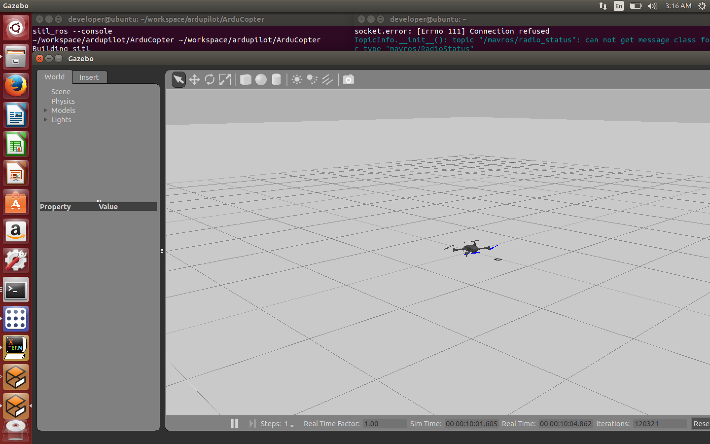

#Set up ROS Gazebo APM SITL environment on Ubuntu
##Install Ubuntu 14.04.3
1. Download Ubuntu 14.04.3 64bit desktop edition image from ubuntu.com
2. Install the system in virtual machine or as second operating system
3. Set the username as developer and password as 12345678

##Clone ardupilot source
1. open terminal in ubuntu
2. run `sudo apt-get install git`
3. make a directory:`mkdir workspace`
4. enter the workspace: `cd workspace`
5. clone the source from github:`git clone https://github.com/alexbuyval/ardupilot`
6. cd ardupilot directory and check out RangeFinderSITL2:```cd ardupilot ```
7. `git checkout RangeFinderSITL2`

##Install ROS
1. `sudo sh -c 'echo "deb http://packages.ros.org/ros/ubuntu $(lsb_release -sc) main" > /etc/apt/sources.list.d/ros-latest.list'`
2. `sudo apt-key adv --keyserver hkp://pool.sks-keyservers.net --recv-key 0xB01FA116`
3. `sudo apt-get update`
4. `sudo apt-get install ros-indigo-desktop-full`
5. `sudo rosdep init`
6. `rosdep update`
7. `echo "source /opt/ros/indigo/setup.bash" >> ~/.bashrc`
8. `source ~/.bashrc`
9. `sudo apt-get install python-rosinstall`

##Create ROS Workspace
1. `mkdir -p ~/catkin_ws/src`
2. `cd ~/catkin_ws/src`
3. `catkin_init_workspace`
4. `cd ~/catkin_ws/`
5. `catkin_make`
6. `echo "source $HOME/catkin_ws/devel/setup.bash" >> ~/.bashrc`
7. `source ~/.bashrc`
8. `echo $ROS_PACKAGE_PATH`
9. if you can see the following message, it's successful:`/home/developer/catkin_ws/src:/opt/ros/indigo/share:/opt/ros/indigo/stacks`

##Clone/Install ROS packages
1. `sudo apt-get install ros-indigo-octomap-msgs`
2. 
```
	roscd
	cd ../src #Navigate in your ROS user source files directory
	git clone https://alexbuyval@bitbucket.org/alexbuyval/arducopter_sitl_ros.git
	git clone https://github.com/PX4/mav_comm.git
	git clone https://github.com/alexbuyval/rotors_simulator.git 
	git clone https://github.com/ros-drivers/joystick_drivers.git
	git clone https://github.com/ethz-asl/glog_catkin.git
	git clone https://github.com/catkin/catkin_simple.git
	git clone https://github.com/ethz-asl/gflags_catkin.git
	cd rotors_simulator
	git checkout sonar_plugin
	cd ../..
	wstool init src 
	wstool set -t src mavros --git https://github.com/alexbuyval/mavros.git
	wstool update -t src 
	rosdep install --from-paths src --ignore-src --rosdistro indigo -y 
```		
3. compile the packages:`roscd`
4. `cd ..`
5. `catkin_make`
6. if the catkin-make failed bacause the lack of gawk, run `sudo apt-get install gawk`
7. setup PATH: `export PATH=$PATH:$HOME/workspace/ardupilot/Tools/autotest`

##Install necessary python package
1. `sudo apt-get install python-pip`
2. `sudo pip install pymavlink`

##Run the simulation
1. `cd ~/workspace/ardupilot/ArduCopter`
2. `sim_vehicle.sh -f arducopter_sitl_ros --console`

##The simulation view


##Reference
[Using ROS/Gazebo Simulator with SITL](http://dev.ardupilot.com/wiki/using-rosgazebo-simulator-with-sitl/)